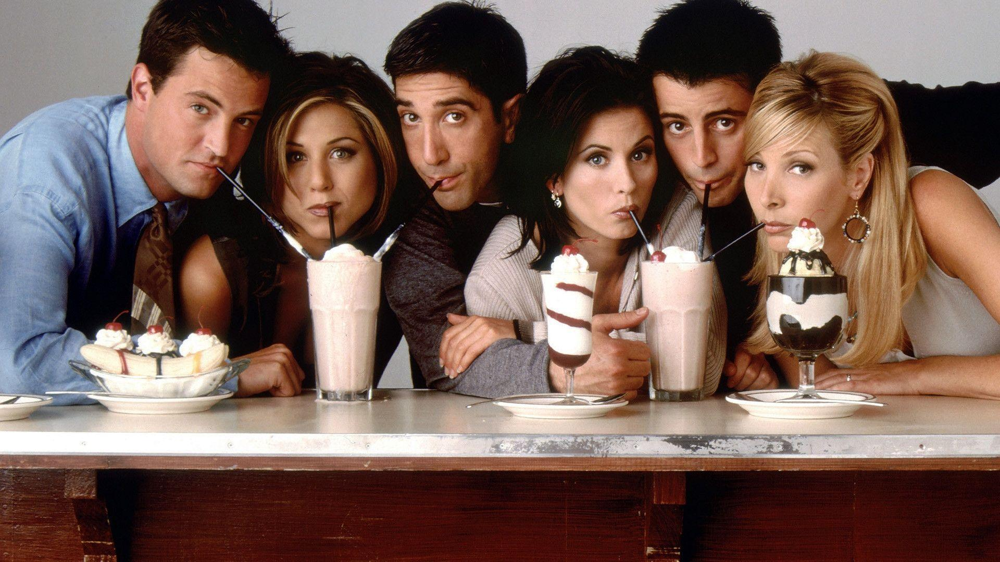

It's one of the top in my favourite series lists. It's the type when you have to chill after a long day; you go home, grab a beer and watch Friends and you'll not be disappointed.

With all the lame and good jokes that they make, it all comes down to how they pull if off; and that I believe is the key.
The series revolves around 6 people, 3 men and 3 women, who live their everyday life with unusual incidents happening. The whole series is built around their funny and infrequent reactions to these incidents.

If you ask me about the funniest character in the series, I'd say it's Jack Geller. I start to cackle the moment that guy opens his mouth because whatever comes out of it is pure gold.

Talking about characters individually, Chandler thrives on sarcasm. Like when Chandler is on call and he says it's the machine; Joey inquires whether it's the answering machine to which Chandler responds as no, it was the leaf blower.

Joey is projected to be the womaniser who wants the next hot woman he meets. Well his reactions to the conversations among the friends in Friends are perfect like when he confronts Rachel's boss about the fact that the boss wants to buy Rachel's baby. The writers have done a very good job in writing but there are only a few people who can pull them off like Joey.

Ross is literally one of the most sophisticated characters in the series. His reactions are top notch. The conversations he has are usually meaningful and logical unless it's around his long time school crush Rachel or some of his other girlfriends/wives.

Rachel is projected as the pretty girl who is into fashion. Her reactions to awkward situations she's put in are lovely and though she's projected as a long time crush of Ross, the major part of the series revolves around their possibility of ending up together.

Monica is the one who has an OCD for organisation. She might be feisty but her OCD is funny. She's too dedicated to that.

Phoebe is the one who behaves weird when everyone is behaving normally and behaves normally when everyone is illogical and weird. She's creepy sometimes as well.

Overall, I love the series and I have always watched it whenever I WAS ON A BREAK

