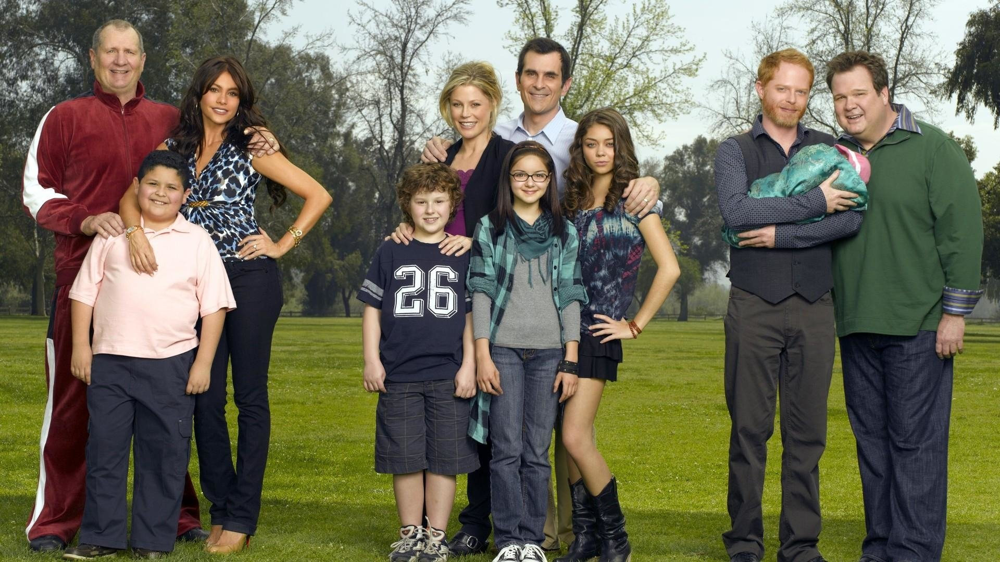

This show is about a family which is perfect in its own way. It is a sitcom which revolves aroung three families that love each other inspite of individual differences. 

It's a show where an old, rich man *Jay Prichett* marries a Columbian woman *Gloria Delgado* half of his age and accepts his openly gay son *Mitchell Pritchett* and his partner *Cameron Tucker*. The gay couple adopts an Asian girl *Lily* . *Manny Delgado* is Gloria's son. Jay's daughter *Claire Pritchett Dunphy*'s teenage pregnancy create the foundation of a loving family. She's married to *Phil Dunphy*. They have three children *Hayley* - the dumb one, *Alex* - the smart one and *Luke* - notorious one. This show makes you live the characters and fall in love with each one of them. This a show you can watch with your family. The only way to love someone is to let them thrive in their own choices - that's what I learned from this show.

> Well said girl 🌻

