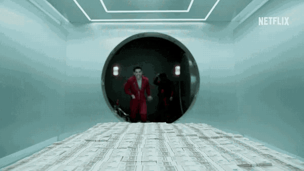

Money Heist is a action+crime+drama where every episode ends at a cliffhanger. The story revolves around a group of robbers who plan to rob the Royal Mint of Spain and then the Bank of Spain because the leader feels that there should be no reason to slave for money when the governments can print money on demand.

#https://tenor.com/view/swimming-in-money-rich-laughing-hysterically-money-dive-jaime-lorente-gif-13865195*/

Well, I would agree with that because look at the current economic situation. People lost their jobs and the governments around the world printed trillions of dollars to keep the economic machine running.

The loss is of the people and the money printed benefits the people at the top. So I agree with the point of view.

Each episode leaves you wondering what is going to happen next and the dopamine spike made me watch the series in one go.
Each of the robbers has a personal story revolving with the heist. That adds to the spark of the series as their plans for the heist are affected by their personal life. Overall, I loved the series. I'd definitely watch more when they come out with a new season.

What do you guys think?
You can send us your review and we'll be happy to post it and share it with everybody ☺️ 😁

