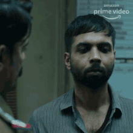
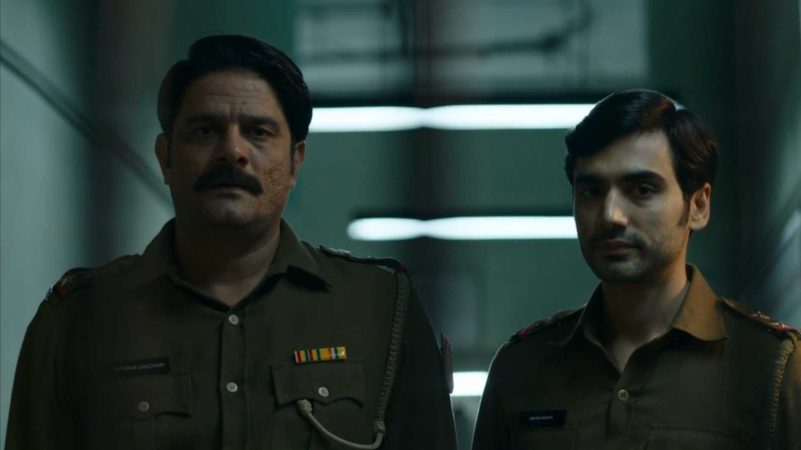

Paatal Lok is another Indian masterpiece that I have seen.

It stands out because it depicts the reality. Though the critics might file FIRs and threaten to cut some scenes out of the show, that's because they are offended by the truth and don't have the mental capacity to handle it.

Paatal Lok revolves around an inspector who is given a high profile case to solve. During his journey, he falls down the rabbit hole and realizes that the case is not what was shown to the public. The narrative of the case was twisted by the government; which is not new as the governments have been doing for hundreds of years to stay in power all over the world.

I loved the show as it depicted life as it happens without much change; the language, the representations, the fine details and basically the real state of our country if I may.

Hathiram Chaudhary acted wonderfully. So did all the main killers. The writers did a damn good job which kept me on the toes until the very end.

There were a few scenes that turned around the whole series; like who could have thought that Hathoda Tyagi didn't kill the journalist due to the journalist's love for dogs because Tyagi's master had taught him "When a dog loves man, he is a good man. When a man loves dog, he is a good man". But these small details make a series what it is.

And I recommend you to try it.

