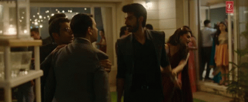
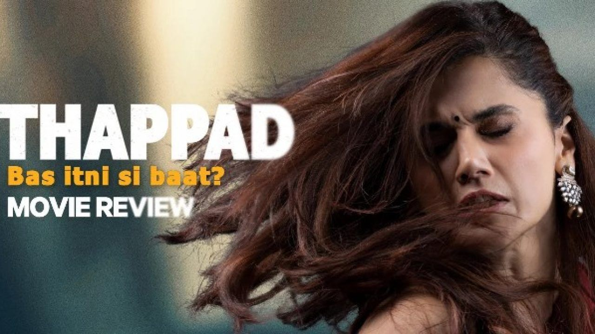

"When you're truly in love, i mean truly in love, thodi bahut maar peet toh expression of love hi hai na sir"

The story is about a young couple (Amrita and Vikram) living a content life. They had a house party for his promotion. He got angry on a work issue and started fighting with his superior and Amrita started to pull him away to stop the fight. He slapped her. She decided to divorce him and the things got ugly.

For all those who think it was just a slap and the girl was overreacting, let me tell you, all of you are jerks. If it was the girl who slapped him instead of the guy for same reason it would have been wrong too and plus she would have been cursed a lot.

Okay so he slapped her and no one told him even once that he was wrong (knowing exactly it was)?! One can see exactly what's wrong with the system (only if you're willing to admit). Moreover people told her to forget it discuss it with the guy and move on!

From waking him up with a beverage to daily checking his mother's blood sugar and sleeping last in the house, she did everything. He was willing to drag her through hell with false accusations in the court and she still took the high road and only accused him for that slap (nothing else). And when she got to know she was pregnant, he tried to take full custody of the baby. He claimed he loved her but you don't do this to the people you love, you are fair in love. And whatever she did was fair.

My favourite character was Amrita's dad who stood by her in everything. Who since the incident said it was wrong even when her mother told her "hota hai".

Thappad makes a strong statement on patriarchy. Patriarchy has been there for a long time and it is etched in people's subconsciousness.

Domestic violence does exist and this movie just scratched it's surface. And i loved the fact that at the end, the maid (Sunita) stood up for herself.

Gender roles are a myth forced down through ages and they have become "conventional". For everyone out there, these doesn't have to be conventional. If you don't feel like it come up with your own system, make a new conventional for yourself. Society doesn't care about you, you don't have to care about it.

